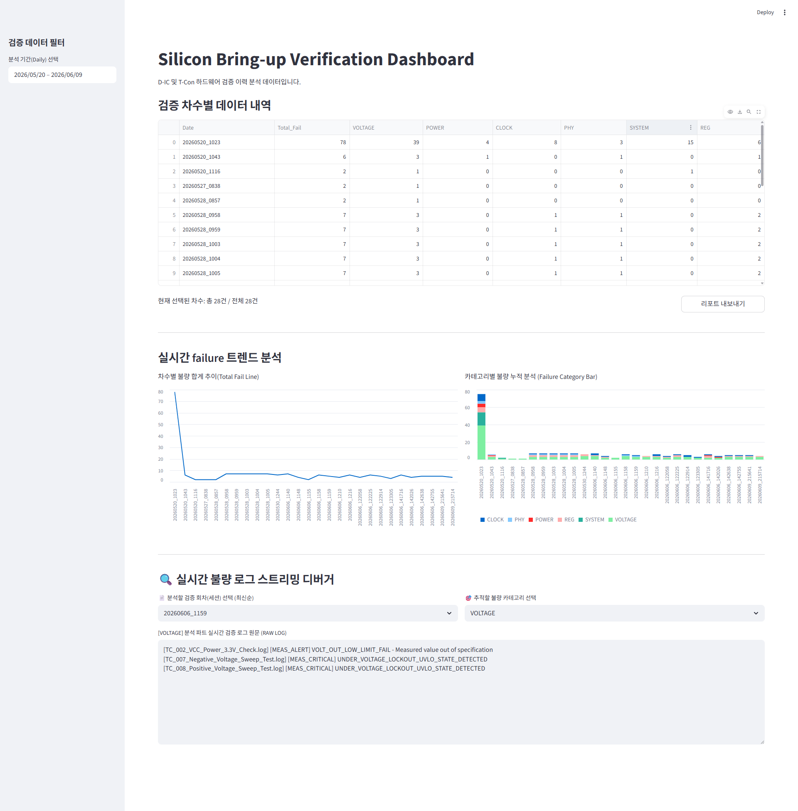

[Silicon Bring-up & High-Speed Interface Automated Verification System]

모바일 D-IC 및 T-Con 구동 기술을 기반으로 하드웨어 실리콘 Bring-up 및 신호 무결성(Signal Integrity) 평가 과정을 완전 자동화한 통합 검증 프레임워크입니다.
수작업으로 진행되던 계측 장비 제어, 데이터 누적, 불량 로그 분석 파이프라인을 자동화하여 검증 턴어라운드 타임(TAT)을 획기적으로 단축하고 인적 오류를 원천 차단하기 위해 개발되었습니다. 
고가의 상용 솔루션 도입이 어려운 중소 팹리스 및 스타트업 환경에 즉시 이식 가능한 크로스 플랫폼(Windows/Linux) 실무형 아키텍처를 지향합니다.

-----------------------------------------------------------------------------------------------------------------------------------------------------------------------------------------------------------------------
대시보드 및 시각화 구성
현장 디버깅을 위한 실시간 파이썬 대시보드와 품질 트렌드 분석을 위한 경영진/엔터프라이즈 보고용 Tableau 대시보드 두 가지로 나누어 구축했습니다.

1. 엔터프라이즈 BI 대시보드 (Tableau)
양산 사업장 표준 인프라와 보고 체계에 맞춘 대시보드입니다. 차수별 품질 추이와 카테고리별 누적 불량 통계를 한눈에 볼 수 있습니다.

🔗 Tableau Public 실시간 BI 대시보드 링크 보기 : https://public.tableau.com/views/Silicon_verification_dashboard/1_1?:language=ko-KR&:sid=&:redirect=auth&:display_count=n&:origin=viz_share_link

2. 엔지니어용 실시간 대시보드 (Python Streamlit)
현장 디버깅과 실시간 로그 스트리밍 확인에 특화된 엔지니어 전용 화면입니다. 타임스탬프 정렬과 조건별 필터가 포함되어 있습니다.

🔗Python Streamlit Dashboard 전체 실행 화면 보기 : 

-----------------------------------------------------------------------------------------------------------------------------------------------------------------------------------------------------------------------
개요 및 해결하려는 문제
- 수동 분석의 한계 및 비용 증가: 엔지니어가 수백 개의 텍스트 로그 파일을 개별적으로 열어 에러 키워드를 검색하는 방식으로 인해 Debugging Time이 증가하고, Bring-up 일정이 지연되는 리스크를 해결합니다.
- 간헐적 불량 탐지 누수 방지: 6.6Gbps High-Speed Interface 환경에서 간헐적으로 발생하는 Lane-to-Lane Skew Violation이나 시스템 Watchdog Timeout 같은 치명적인 타이밍/프로토콜 불량 패턴을 휴먼 에러 없이 정확히 낚아챕니다.
- Internal Eye Scan 마진 검증 공백 메움: 고가의 외장 오실로스코프 프로빙이 어려운 미세 패키징 환경에서, 수신기(RX) 내부 회로를 제어하여 Eye Width(시간 마진) 및 Eye Height(Vref 전압 마진)를 자동으로 가변 측정하고 불량 유무를 판정합니다.
- 야간 롱런(Long-Run) 시험 중단 리스크 제거: 밤샘 검증 중 장비 통신 오류나 타임아웃으로 시스템이 튕겼을 때, 처음부터 다시 모든 테스트 케이스(TC)를 돌릴 필요 없이 실패한 지점부터 이어 돌리는 고강도 연속성을 보장합니다.
- 데이터와 코드의 완전 분리: 새로운 칩셋 Spec이나 신규 불량 코드가 추가될 때마다 검증 소스 코드를 매번 직접 수정해야 하는 유지보수 비효율을 정규표현식 매핑 테이블 구조로 해결합니다.
  
-----------------------------------------------------------------------------------------------------------------------------------------------------------------------------------------------------------------------
시스템 아키텍처
본 시스템은 실행기(Runner), 분석기(Parser), 실시간 웹 대시보드(Dashboard)가 유기적으로 결합된 데이터 파이프라인 구조를 가지며, 철저한 시스템 인프라 방어 로직이 설계되어 있습니다.
[config.json] -> [runner.py (병렬 엔진 & Lock)] -> 장비 제어 및 로그 생성 -> [parser.py (Failure Triage)] -> [Streamlit Dashboard]

1. 실행기 (runner.py, config.json, main.py)
- 설정 기반 자동 제어: JSON 설정 파일을 파싱하여 복잡한 레지스터 설정, Voltage Sweep, 주파수 마진 검증 시나리오를 자동으로 실행합니다. 특히 내부 Vref Max/Min 한계치를 추적하는 스캔 시나리오를 자동화합니다.
- 스레드 풀 병렬 엔진: ThreadPoolExecutor 기반으로 최대 4개 채널을 병렬 구동하여 검증 속도를 극대화합니다.
- 하드웨어 상호 배제 (Device Lock): 멀티스레드 환경에서 동일 계측 장비에 커맨드가 꼬여 락업(Lock-up)이 걸리는 것을 방지하기 위해 threading.Lock() 동기화를 제어합니다.
- 실시간 실무형 Resume 기능: 검증 재시작 시 기존 폴더 내 로그 파일의 존재 여부뿐만 아니라, 내용물 내에 장비가 뱉은 'PASS' 각인 여부를 엄격히 파싱하여 실패(FAILED)했거나 중단된 차수만 콕 집어 재시험을 수행합니다.
- 인프라 방어 및 디스크 로테이션: 실행 전 시스템 잔여 용량을 체크하여 마진 부족 시 기존 로그를 zipfile로 자동 압축 보관 후 원본을 비워 서버 다운을 원천 차단합니다. 15초 장비 타임아웃 보호 장치가 내장되어 있습니다.

3. 분석기 (parser.py, error_map.json)
- 정밀 정규표현식(re) 매칭 엔진: 오실로스코프 및 계측기 원문 로그에서 에러 코드뿐만 아니라 불량이 발생한 채널(ch), 측정 수치(meas), 스펙 리밋(limit) 데이터를 동적으로 추출합니다.
- Failure Triage 자동 분류: MIPI Lane-to-Lane Skew Violation, 6.6Gbps Link Training Fail, VCO Range Over, Watchdog Timeout은 물론 Vref Margin Violation (Eye Height 부족) 등의 불량을 규칙 기반 알고리즘으로 카테고리화하여 정밀 통계를 누적합니다.

4. 웹 대시보드 리포터 (app.py)
- 크로스 플랫폼 자동 팝업: 검증 및 데이터 집계가 마감되는 즉시 main.py 총사령관이 OS 환경을 판별(os.name)하여 브라우저에 실시간 수율 차트와 불량 빈도 순위 대시보드를 자동 팝업합니다. (웹 주소창을 제거한 --app 단독 윈도우 UI 모드 지원)
- 구조화된 리포트 다운로드: 필터링된 데이터를 기반으로 구조화된 TXT 엔지니어링 리포트를 실시간 빌드하여 즉시 내보내기 버튼을 제공합니다.

-----------------------------------------------------------------------------------------------------------------------------------------------------------------------------------------------------------------------
기술 스택
- 언어: Python 3.11+ / 3.12 (신뢰성 중심의 가상환경 규격 반영)
- 하드웨어 인터페이스: PyVISA (Virtual Instrument Software Architecture), pyvisa-sim
- 데이터 분석 & 시각화: Pandas, Streamlit
- 동시성 제어 및 검증: Concurrent.futures (ThreadPoolExecutor), Threading (Lock), pytest
  
-----------------------------------------------------------------------------------------------------------------------------------------------------------------------------------------------------------------------

구동 및 설치 방법 (크로스 플랫폼 및 폐쇄망 완벽 대응)
대다수 팹리스 계측실 및 스타트업 보안 구역 PC는 외부 인터넷이 차단된 폐쇄망 환경입니다. 본 시스템은 의존성 패키지를 로컬에 사전 내장하여 인터넷 연결 없이 즉시 구동이 가능합니다.

Case A. 인터넷 연결이 불가능한 보안 계측실 (폐쇄망 환경)
1. 인터넷이 가능한 외부 PC에서 필수 패키지 바퀴(*.whl)를 미리 다운로드합니다.
   pip download -r requirements.txt -d ./offline_packages
3. 프로젝트 폴더를 보안 USB에 담아 장비 PC(Windows 또는 Linux)로 복사합니다.
4. 로컬 패키지 경로를 지정하여 인터넷 없이 의존성을 100% 구축합니다.
   pip install --no-index --find-links=./offline_packages -r requirements.txt

Case B. 일반 개발 환경 (온라인 환경 원터치 구동)
1. Windows 환경: 폴더 내에 위치한 run.bat 파일을 더블클릭하여 실행하거나 터미널에 아래 명령어를 입력합니다.
   call .venv\Scripts\activate 후 python main.py
3. Linux (Ubuntu/CentOS) 환경: 리눅스 서버 터미널 환경에서 실행 권한을 부여한 뒤 run.sh를 구동합니다.
   chmod +x run.sh 후 ./run.sh

-----------------------------------------------------------------------------------------------------------------------------------------------------------------------------------------------------------------------
기대 효과 (Business Value)
- 비용 절감: 수천만 원 상당의 외산 상용 자동화 솔루션 없이도 오픈소스 파이썬 인프라만으로 커스텀 탑티어 검증 파이프라인 구축 및 독립적 유지보수가 가능함을 증명합니다.
- 검증 TAT(Turnaround Time) 80% 단축: 100% 자동화된 반복 스위핑 및 일괄 파싱 파이프라인을 통해 엔지니어의 단순 리소스를 절감하고 핵심 디버깅 및 신호 마진(Signal Integrity) 분석에만 집중할 수 있게 합니다.
- 야간 무인 검증 신뢰성 확보: 장비 락 방지 및 무한 루프 차단, 실패 차수 선별 Resume 메커니즘을 통해 엔지니어가 퇴근한 야간 시간대에도 24시간 중단 없는 강건한 검증을 보장합니다. 

